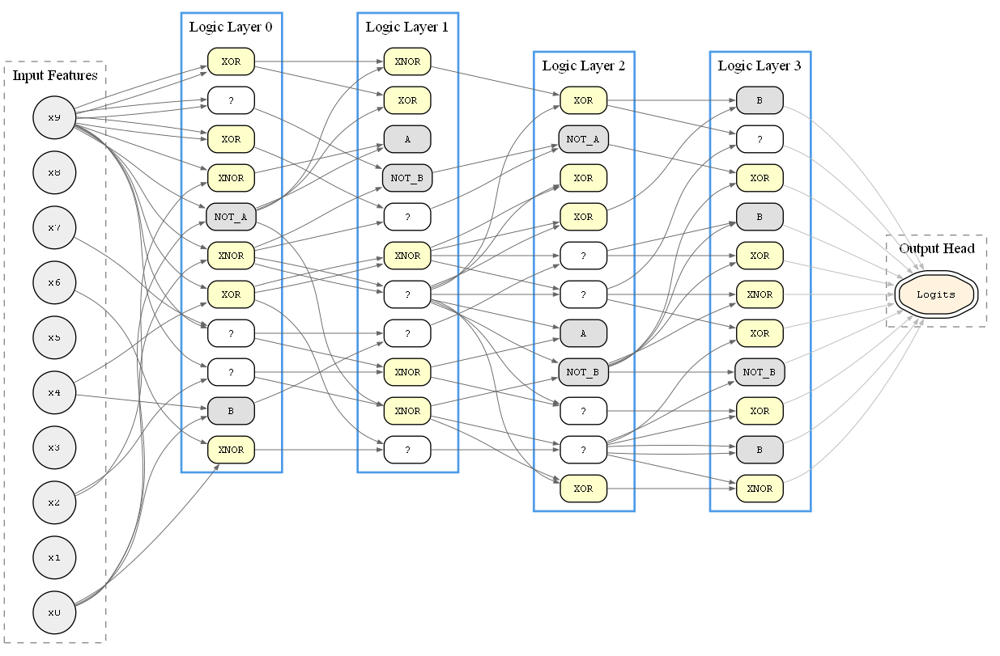
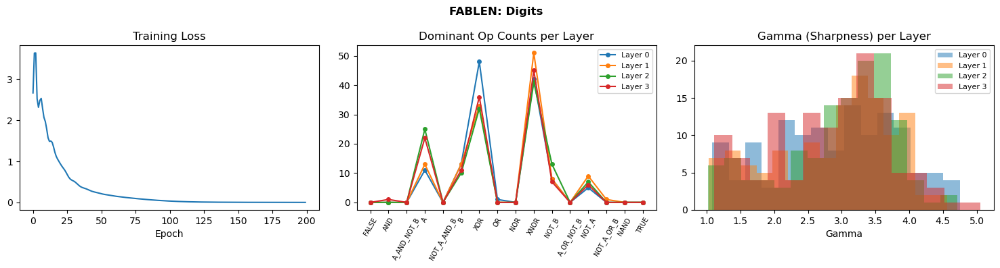
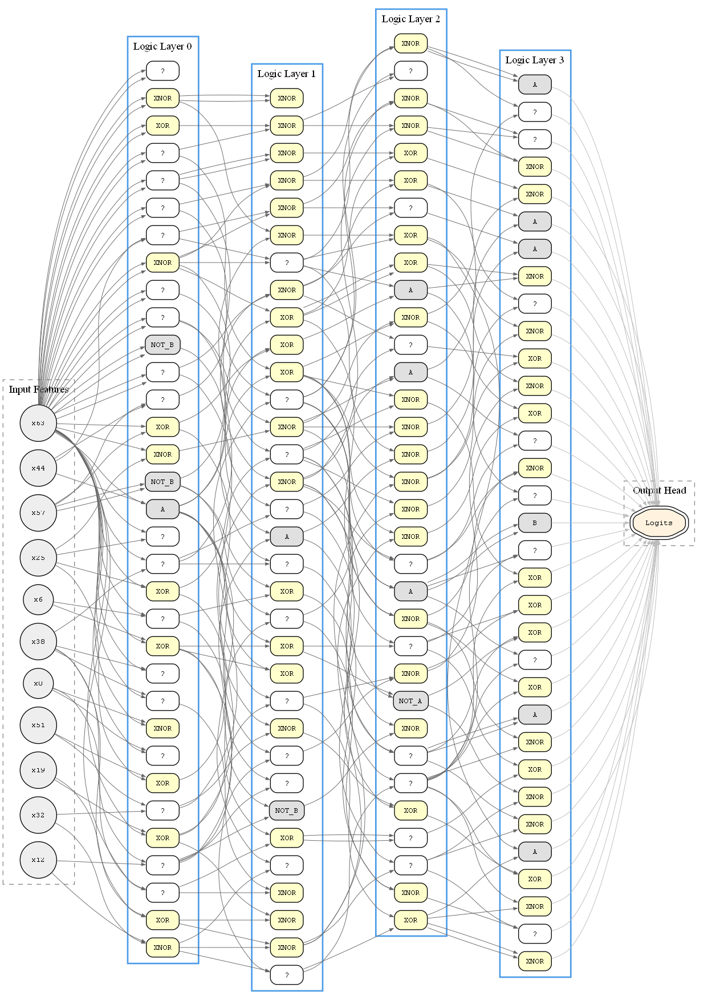
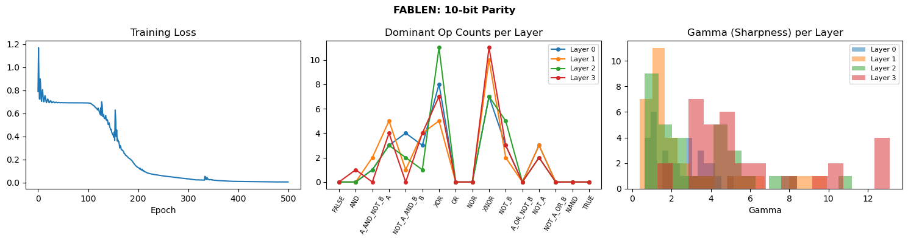
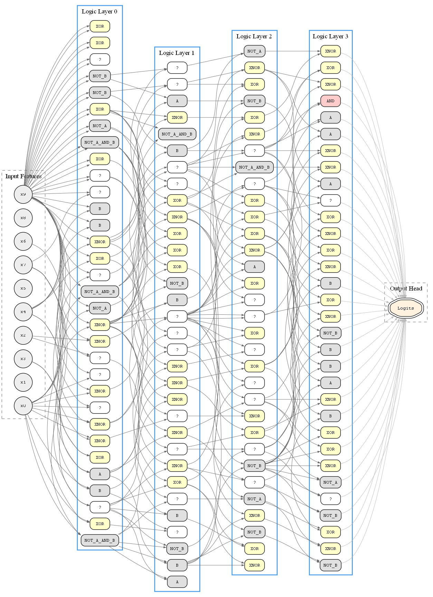

# FABLEN: Fuzzy Adaptive Bilinear Logic Engine Networks

### Research Notes: Architecture, Derivation & Characterization

## 1. Naming

The core primitive is **FABLEN**: *Fuzzy Adaptive Bilinear Logic Engine Networks*. This document covers the standalone FABLEN module: its mathematical derivation, differences from prior work, empirical characterization across tasks, and open questions.

> 

## 2. Prior Work: What We Build On

The foundational paper is Petersen *et al.*, *Deep Differentiable Logic Gate Networks* (2022) [1], with follow-on work in recurrent extensions by Bührer *et al.*, *Recurrent Deep Differentiable Logic Gate Networks* (2025) [2], and Łukasiewicz T-norm variants by Nguy & Wasilewski (2025) [3]. Their shared design choices:

- **Fixed random connectivity.** Each neuron receives exactly 2 inputs, wired pseudo-randomly at initialization and never changed. Connectivity is intrinsically sparse (Θ(n) per layer vs Θ(n·m) for fully connected) [1].
- **Softmax over 16 Boolean ops.** Each neuron holds a distribution over all 16 binary Boolean functions; soft during training, discretized to argmax at inference.
- **Post-training discretization.** The continuous relaxation enables gradient training that yields a hard logic circuit at inference time. On MNIST, Petersen *et al.* report ~314× faster CPU inference (7 μs vs 2.2 ms) vs a conventional ANN at comparable accuracy (98.47% vs 98.40%) [1].
- **Bit-counting output aggregation.** Classes are determined by counting 1-bits in output groups, not a learned linear head [1]. RDDLGN adapts this to GroupSum + softmax for sequence-to-sequence output [2].
- **Binary inputs.** Petersen *et al.* assume inputs are already in {0,1} or binarized. RDDLGN uses dense embeddings followed by sigmoid to bridge continuous token representations into the [0,1] domain required by logic gates [2]. Nguy & Wasilewski introduce progressive threshold discretization for continuous inputs (e.g., 31 thresholds per pixel for CIFAR-10) [3].

The goal in those papers is explicitly **logic circuits** with interpretability, discretization, and hardware efficiency.

## 3. Our Goal: A Different Use

We do not want a logic circuit. We want a **richer inductive bias** for continuous neural networks.

Standard MLP neurons compute `σ(w·x + b)` which is a linear combination followed by a scalar nonlinearity. This is expressive but provides no prior toward feature *interaction* structure. If two features interact multiplicatively (as in XOR, parity, or gating), the MLP must discover this through many layers of composition.

Petersen *et al.* demonstrate that networks whose neurons select from a fixed set of Boolean primitives can match or exceed conventional ANNs on structured tasks (MNIST, MONK benchmarks) while achieving dramatically faster inference post-discretization [1]. RDDLGN extends this to sequential tasks, showing logic gate networks can learn sequence-to-sequence mappings (machine translation) when paired with learned embeddings [2]. The common thread: making logical operations explicitly available as primitives is sufficient for gradient descent to find working solutions on tasks with boolean or rule-based structure. But fixing the wiring randomly and discretizing post-training sacrifices adaptability.

**Our question:** what if we kept the operation set but made the wiring learned and the outputs continuous?

This gives the model a *toolbox* from the very start such as: AND, OR, XOR, NAND, routing identities, negations; without requiring it to implement a logic circuit. Whether it uses those tools in a logic-like way appears to depend on the task, which is empirically interesting (see Section 6).

## 4. The FABLEN Architecture

### 4.1 Mathematical Characterization

Let $x \in [0,1]^{D_{in}}$ be the input vector. A FABLEN layer with $D_{out}$ neurons computes:

**Step 1 Input Projection.** A learned per-dimension affine rescale before sigmoid maps real-valued inputs into $[0,1]$:

$$x_{\text{logic}} = \sigma\!\left(\alpha \odot x + \beta\right), \quad \alpha \in \mathbb{R}^{D_{in}},\ \beta \in \mathbb{R}^{D_{in}}$$

initialized at $\alpha = 1.5$, $\beta = 0$. Without this, LayerNorm output ($\approx \mathcal{N}(0,1)$) maps through sigmoid to only $(0.27, 0.73)$; 46% of the $[0,1]$ range.

While a higher scale (e.g., $\alpha=2.0$) expands the initial range to $\approx 76\%$, we observed that it often leads to training instability and late-stage convergence collapse in deep logical chains due to premature saturation observed in parity task. The recommended $\alpha = 1.5$ provides a robust balance: it expands the initial active range to $\approx 64\%$ while maintaining stronger gradient flow during fine-tuning, ensuring stable convergence to sharp logical states (high $\gamma$) by the end of training. Both $\alpha$ and $\beta$ are learned per-dimension during training.

**Step 2 Sparse Selection.** Each output neuron $j$ selects two input slots via learned Sparsemax projections:

$$w^{(j)}_s = \text{Sparsemax}(\ell^{(j)}_s) \in \Delta^{D_{in}}, \quad s \in \{A, B\}$$

$$a_j = \sum_i w^{(j)}_{A,i} \cdot x_{\text{logic},i}, \qquad b_j = \sum_i w^{(j)}_{B,i} \cdot x_{\text{logic},i}$$

where $\ell^{(j)}_s \in \mathbb{R}^{D_{in}}$ are learned logits. Sparsemax projects onto the simplex with a piecewise-linear map that produces *exact zeros*, making selection genuinely sparse rather than merely peaked.

**Selection initialization (diversity prior).** Slots A and B are initialized with independent $\mathcal{N}(0, 0.1)$ noise, but with a small additive bump on *different* input indices per neuron where slot A is biased toward index $j \bmod D_{in}$, slot B toward $(j + D_{in}/2) \bmod D_{in}$. This breaks the symmetry between slots at birth without imposing a hard constraint: Sparsemax can override the nudge if the task rewards same-input selection (e.g., `NOT_A(x,x) = 1-x` is a valid single-input negation). Without this prior, both slots start from nearly identical logits and gradient descent has no pressure to push them apart, leading to pathological same-input selections such as `XOR(x,x) ≈ 0`.

**Step 3 16-Op Fuzzy Mixture.** Each of the 16 binary Boolean functions has a continuous fuzzy relaxation. The neuron computes a softmax-weighted mixture:

$$y_j^{\text{raw}} = \sum_{k=0}^{15} p^{(j)}_k \cdot f_k(a_j, b_j), \qquad p^{(j)} = \text{softmax}(\phi^{(j)})$$

where $\phi^{(j)} \in \mathbb{R}^{16}$ are learned op-selection logits, initialized at $\mathcal{N}(0, 0.1)$.

The 16 ops and their fuzzy forms:

| ID | Op | Fuzzy form $f_k(a,b)$ |
|----|----|-----------------------|
| 0 | FALSE | $0$ |
| 1 | AND | $ab$ |
| 2 | A ∧ ¬B | $a(1-b) = a - ab$ |
| 3 | A | $a$ |
| 4 | ¬A ∧ B | $(1-a)b = b - ab$ |
| 5 | B | $b$ |
| 6 | XOR | $a + b - 2ab$ |
| 7 | OR | $a + b - ab$ |
| 8 | NOR | $1 - a - b + ab$ |
| 9 | XNOR | $1 - a - b + 2ab$ |
| 10 | ¬B | $1-b$ |
| 11 | A ∨ ¬B | $1 - b + ab$ |
| 12 | ¬A | $1-a$ |
| 13 | ¬A ∨ B | $1 - a + ab$ |
| 14 | NAND | $1 - ab$ |
| 15 | TRUE | $1$ |

**Step 4 Sharpness.** A learned per-neuron sharpness $\gamma_j = \exp(\log\hat{\gamma}_j) > 0$ pushes outputs toward $\{0, 1\}$:

$$y_j = \text{clamp}\left(0.5 + \gamma_j(y_j^{\text{raw}} - 0.5),\ 0,\ 1\right)$$

$\log\hat{\gamma}$ is initialized to $0$ (so $\gamma = 1$ at init, identity on $[0,1]$). As $\gamma \to \infty$ this becomes a hard threshold at 0.5. Sharpness is learned, not annealed, so the network decides how hard to commit.

**Step 5 Residual.** Layers are stacked with a residual connection:

$$x \leftarrow x + \text{FABLEN}(\text{LN}(x))$$

> **Note:** Previous experiments used a fixed `(x + FABLEN(x)) / 2` blend. Current implementation uses standard `x + FABLEN(LN(x))` residual which is consistent with transformer conventions and removes an untuned scalar. The `/2` version has not been ablated against standard residual; this is worth a direct comparison on parity.

### 4.2 The Bilinear Decomposition

Every fuzzy Boolean op is bilinear in $(a, b)$:

$$f_k(a, b) = c_k^{(0)} + c_k^{(1)} a + c_k^{(2)} b + c_k^{(3)} ab$$

for fixed coefficients $c_k \in \{-2,-1,0,1,2\}^4$. The softmax mixture therefore collapses to:

$$y_j^{\text{raw}} = \kappa_j^{(0)} + \kappa_j^{(1)} a_j + \kappa_j^{(2)} b_j + \kappa_j^{(3)} a_j b_j$$

where $\kappa^{(j)} = \sum_k p^{(j)}_k c_k$, computed as:

$$\mathbf{K} = P \cdot C \in \mathbb{R}^{D_{out} \times 4}$$

with $P \in \mathbb{R}^{D_{out} \times 16}$ the op weight matrix and $C \in \mathbb{R}^{16 \times 4}$ the fixed coefficient table (See: Appendix). This reduces the forward pass from a $[N, D_{out}, 16]$ intermediate tensor to a single $[16 \times 4]$ matmul plus 4 elementwise ops on $[N, D_{out}]$ tensors. Numerically equivalent; verified by max absolute error $< 10^{-5}$.

### 4.3 Differences from Petersen *et al.* [1]

| Dimension | Petersen *et al.* (dLGN) | FABLEN |
|-----------|------------------------|--------|
| Wiring | Fixed random, not trained | Learned via Sparsemax |
| Selection | Hard one-hot (fixed) | Soft sparse (Sparsemax) → near-discrete |
| Op mixture | Softmax during training, argmax post-training | Softmax, stays continuous |
| Discretization | Explicit post-training step | Optional via sharpness γ |
| Input domain | Binary {0,1} | Continuous [0,1] via learned affine + sigmoid |
| Output domain | Binary {0,1} | Continuous [0,1] |
| Goal | Fast discrete logic circuit | Inductive bias for continuous nets |
| Interpretability | Primary goal | Emergent, not required |
| Output aggregation | Bit counting per class | Learned linear head |

The most fundamental difference: Petersen *et al.* use the op set as an *end state*. We use it as a *prior* with which the network is given logical tools and chooses whether to use them.

## 5. Empirical Characterization

A key putative finding is that **FABLEN's behavior adapts to the task structure**. The same module operates in qualitatively different regimes depending on what the loss landscape rewards.

### 5.1 Digits Classification (sklearn digits, 8×8 pixel inputs)

**Training:** 151,434 params, 180 epochs, final test accuracy **96.39%**.

> 
> 
> **Reading this diagram:** Each layer displays up to `max_neurons` representative neurons (evenly subsampled from the full layer width). Edges show the strongest input connection per slot, mapped to the nearest *displayed* node in the previous layer; not the exact learned connection. Input connection density reflects learned selection frequency, not information content; boundary features may appear over-represented due to initialization asymmetries in the input projection rather than task-relevant structure.

Layer 0 diagnostics (representative; Layer 1 is nearly identical):

| Metric | Value |
|--------|-------|
| Dominant ops | XOR (37.5%), XNOR (32.8%), B (10.2%), A (8.6%), ¬B (6.2%), ¬A (3.9%) |
| Op confidence | 116/128 neurons below 25%; fully diffuse |
| Selection sparsity | 0.898; near-discrete |
| Sharpness γ | mean 2.89, max 4.75, 80.5% of neurons above γ=2 |

The result indicates the **dominance of XOR and XNOR (combined ~70.3%)**. This is a consequence of the diversity initialization with slots A and B now starting biased toward different inputs, neurons are structurally encouraged to *compare* features rather than merely route them. XOR and XNOR are comparison operators: XOR(a,b) ≈ 1 when features differ, XNOR(a,b) ≈ 1 when they agree. For digit pixel classification, comparing whether two pixel regions are both active is a natural and efficient feature, it captures edge and pattern co-occurrence.

Op confidence remaining below 25% is expected for a continuous perceptual task in which the network is using a soft mixture of operations rather than committing to hard logic gates, which is appropriate when the decision boundary is not boolean-structured.

### 5.2 10-Bit Parity (4-Layer Stack)

**Training:** 11,298 params, 500 epochs, final test accuracy **99.90%**.
> 

> 
> **Reading this diagram:** Edges show the strongest input connection per slot, mapped to the nearest *displayed* node in the previous layer; not the exact learned connection. Input connection density reflects learned selection frequency, not information content; boundary features (x0, x9) may appear over-represented due to initialization asymmetries in the input projection rather than task-relevant structure.

Layer 0 and Layer 3 diagnostics:

| Metric | Layer 0 | Layer 3 |
|--------|---------|---------|
| Dominant ops | XOR (25%), XNOR (21.9%), A/B/¬A/¬B (~40%) | XNOR (34.4%), XOR (21.9%), A/B (~25%) |
| Op confidence | 20 neurons <25%, 7 at 25–50%, **5 at 50–75%** | 5 neurons <25%, 18 at 25–50%, **9 at 50–75%** |
| Selection sparsity | 0.930 | **0.981** |
| Sharpness γ mean | 2.39 | **5.83** |
| Sharpness γ max | 5.15 | **13.13** |
| Neurons above γ=2 | 56.2% | **93.8%** |

Top committed neurons in Layer 0 (by op confidence): XOR (conf=0.58, γ=3.62), XNOR (conf=0.62, γ=5.15), XNOR (conf=0.57, γ=3.81).

**Layer-wise progression:** The depth gradient is the core finding. Layer 0 starts with mixed op palette and moderate sharpness which indicate neurons are still deciding what to compute. Layer 3 shows strongly increased sparsity (0.981 vs 0.930), higher confidence (majority at 25–75% vs mostly below 25%), and dramatically higher sharpness (mean γ=5.83 vs 2.39, max 13.1 vs 5.1). Later layers are committing harder to specific operations on specific feature pairs, consistent with the aggregation phase of a parity tree.

XOR/XNOR remain dominant throughout all four layers (combined 40–55% per layer), confirming FABLEN discovers the structurally correct primitive for parity without being told. The `[Parity XOR Check]` across layers: Layer 0: 25.0%, Layer 1: 15.6%, Layer 2: 34.4%, Layer 3: 21.9%; XOR dominance is distributed across depth rather than concentrated, which differs from the previous result (old model showed XOR→AND specialization layer by layer). This is plausibly a consequence of the standard residual replacing the `/2` blend, the residual stream retains more information across layers, so later layers don't need to shift to a purely aggregative AND pattern.

> **Open:** The old model (with `/2` residual) showed a cleaner XOR-in-early-layers → AND-in-late-layers specialization. The current model (standard Pre-LN residual) shows XOR/XNOR distributed throughout. Whether this affects task accuracy is unknown. A direct ablation would clarify whether the specialization pattern or the accuracy is the more meaningful comparison point.

## 6. Three-Mode Summary

Across experiments, FABLEN operates in one of three* empirically distinguishable modes:

| Mode | Task | Selection sparsity | Op confidence | Sharpness γ | Dominant ops |
|------|------|--------------------|---------------|-------------|--------------|
| **Logic circuit** | Parity | 0.93–0.98 (deepens with layer) | 0.27–0.39 (grows with layer) | 2.4→5.8 (escalates with depth) | XOR, XNOR throughout |
| **Feature comparator** | Digits | ~0.90 | ~0.25 (diffuse, stable) | ~2.9 (uniform across layers) | XOR, XNOR (~70%), soft mixture |

The mode is not chosen explicitly, it emerges from the loss landscape. This is the core property FABLEN offers over standard MLPs: it can specialize to the appropriate computational style for the task while using the same parameter structure throughout.

The digits result with diversity initialization reveals a refinement to the earlier "feature router" characterization. With symmetric slot initialization, neurons defaulted to identity/negation ops (just routing features through). With diversity initialization encouraging distinct slot selection, neurons shifted toward XOR/XNOR comparison operators. This suggests the earlier "feature router" mode was partly an initialization artifact rather than a pure task property.

> **Note:** *A third mode (smooth continuous gate, γ ≈ 1, sparsity ~0.5) was observed when FABLEN is used as a multiplicative gate inside a language model block. That use case is documented separately and is not part of the standalone FABLEN module characterization.

## 7. Open Questions

**Architecture:**

- **Residual blend ablation:** current implementation uses `x + FABLEN(LN(x))`. Prior experiments used `(x + FABLEN(x)) / 2`. Both reach ~99% on parity but show different layer-specialization patterns (old: XOR→AND across depth; new: XOR/XNOR distributed throughout). Whether the specialization pattern or task accuracy is the more meaningful comparison point is unresolved.
- **Diversity initialization scaling:** the slot diversity nudge uses offset `D_{in}/2`. Whether this remains well-calibrated at `D_{in}=512+` is untested; at very large dims the nudge becomes negligible relative to noise.
- **Sparsemax at larger dims:** sparsity score is 0.91–0.98 at hidden_dim=32–128. Whether sparsemax remains discriminative at dim=512+ is untested.

**Training dynamics:**

- **Entropy regularization on `op_logits`:** op confidence stays below 25% on digits even with diversity init. Forcing commitment via entropy penalty might sharpen interpretability, but risks over-constraining before the task structure is clear. Worth testing with annealed λ.
- **Gumbel-Softmax annealing:** keeping op selection soft throughout maintains gradient flow but prevents strong commitment. Annealing tau from 1.0→0.1 over training could bridge toward dLGN-style discretization without a hard post-training step.
- **Deeper parity stacks:** 4L reaches 99.90%. Whether 6L/8L improves further or saturates is untested.

## 8. Related Works/Repo

- [difflogic - A Library for Differentiable Logic Gate Networks
](https://github.com/Felix-Petersen/difflogic)

## 10. References & Citation

If you use this work, please cite this repository and the following papers:

```bibtex
@software{FABLEN,
  author  = {GP Bayu},
  title   = {{FABLEN}: Fuzzy Adaptive Bilinear Logic Engine Networks},
  url     = {https://github.com/gbyuvd/FABLEN},
  version = {0.1},
  year    = {2026},
}
```

[1]:
```bibtex
@misc{petersen2022deepdifferentiablelogicgate,
      title={Deep Differentiable Logic Gate Networks}, 
      author={Felix Petersen and Christian Borgelt and Hilde Kuehne and Oliver Deussen},
      year={2022},
      eprint={2210.08277},
      archivePrefix={arXiv},
      primaryClass={cs.LG},
      url={https://arxiv.org/abs/2210.08277}, 
}
```

[2]:
```bibtex
@misc{bührer2025recurrentdeepdifferentiablelogic,
      title={Recurrent Deep Differentiable Logic Gate Networks}, 
      author={Simon Bührer and Andreas Plesner and Till Aczel and Roger Wattenhofer},
      year={2025},
      eprint={2508.06097},
      archivePrefix={arXiv},
      primaryClass={cs.LG},
      url={https://arxiv.org/abs/2508.06097}, 
}
```

[3]:
```bibtex
@inproceedings{inproceedings,
author = {Nguy, Chan and Wasilewski, Piotr},
year = {2025},
month = {10},
pages = {219-230},
title = {Deep Differentiable Logic Gate Networks Based on Fuzzy Łukasiewicz T-norm},
volume = {43},
journal = {Annals of computer science and information systems},
doi = {10.15439/2025F1666}
}
```

### 11 Appendix: Ops Bilinear Coef Table

```text
    # c0    c1    c2    c3     op name
    [ 0.,   0.,   0.,   0.],  # FALSE        = 0
    [ 0.,   0.,   0.,   1.],  # AND          = a·b
    [ 0.,   1.,   0.,  -1.],  # A_AND_NOT_B  = a - a·b
    [ 0.,   1.,   0.,   0.],  # A            = a
    [ 0.,   0.,   1.,  -1.],  # NOT_A_AND_B  = b - a·b
    [ 0.,   0.,   1.,   0.],  # B            = b
    [ 0.,   1.,   1.,  -2.],  # XOR          = a + b - 2a·b
    [ 0.,   1.,   1.,  -1.],  # OR           = a + b - a·b
    [ 1.,  -1.,  -1.,   1.],  # NOR          = 1 - a - b + a·b
    [ 1.,  -1.,  -1.,   2.],  # XNOR         = 1 - a - b + 2a·b
    [ 1.,   0.,  -1.,   0.],  # NOT_B        = 1 - b
    [ 1.,   0.,  -1.,   1.],  # A_OR_NOT_B   = 1 - b + a·b
    [ 1.,  -1.,   0.,   0.],  # NOT_A        = 1 - a
    [ 1.,  -1.,   0.,   1.],  # NOT_A_OR_B   = 1 - a + a·b
    [ 1.,   0.,   0.,  -1.],  # NAND         = 1 - a·b
    [ 1.,   0.,   0.,   0.],  # TRUE         = 1
```
